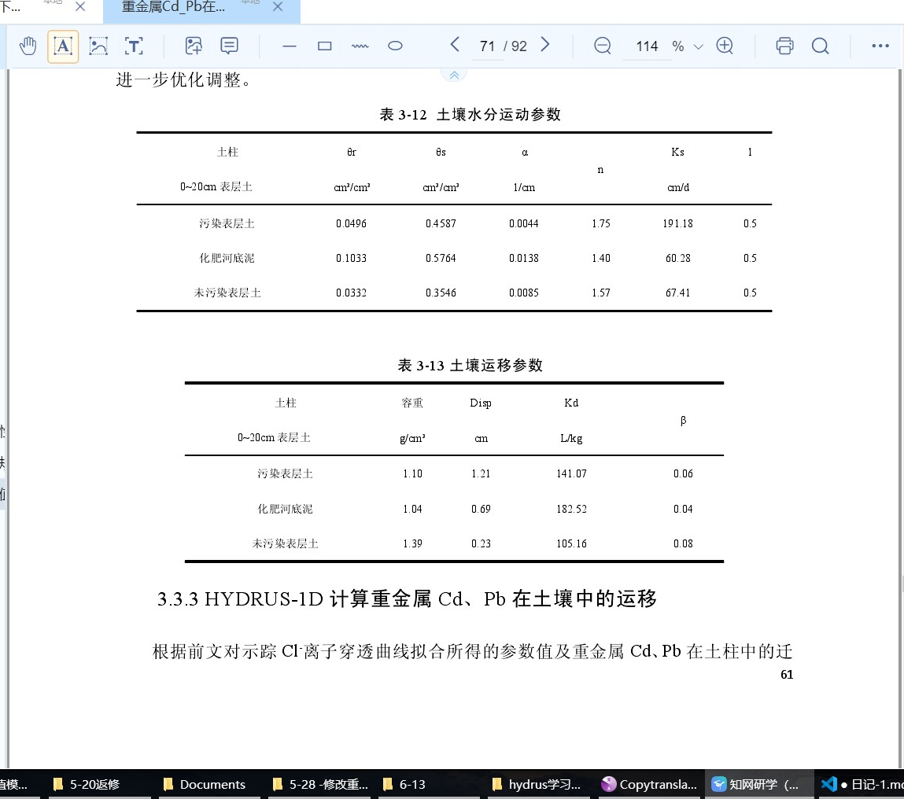
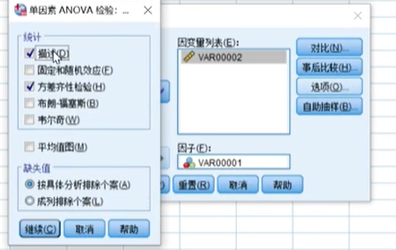

# 日记文件

## 2021 年 5 月 8 日 星期六

## 2021 年 6 月 1 日 星期二

要做的事情

    1 福建农业学报 修改重复率 最迟明天完成
    2 修改毕业论文 修改格式，6月3号上午就要提交完成，明天也需要完成
    3 师姐的土柱实验需要帮忙完善实验方案
    4 3个电镀厂的数据分析
    5 水库的论文
    6 一篇综述

## 6-2

    7点起床-10点 玩看视频
    下午晒微改了一下估计时间不超过半个小时
    我到底要怎么样才能发改变‘
    现在都这个样子了为什么我还是这样咸鱼

## 6-6 星期天

    和丘博要确认的 再次确认下面试时间
    面试需要注意的事情，
    面试大概会问那些问题 和 需要做那些准备

## 6-7 星期 1

    论文又被退稿
    1 与赵涛的硕士毕业论文重复过高
    我真的是无语了

## 6-8 星期二

    昨天也还是什么都

## 6-13 星期天

    在中国给排水上投稿 人工湿地最近研究进展论文
    我想要什么就的付出什么
    不能再这样下去了
    我已经浪费了太多的时间

    我要把娱乐视频什么都戒掉，我对手吗感兴趣都应该看什么

    什么对我有用，看什么

    我在抗拒什么，
    想到要改论文就走：改论文，已经成为了我的痛苦，我一想到论文就难受，自然内心就要逃走
    1. 不想学习的时候：只要出现不想学习的念头就把完成一个每日任务（比如说每天背单词10个），用学习打败不想学习。
    2. 人造自动化： 把学习变成习惯，如果。。。。就。。。  如果到家，就做一道题。如果睡觉，就背5个单词。形成暗示
    3. 呼吸法。放慢呼吸，没次呼气吸气加长10S。重复10次
    4. 杜绝完美主义，
       1. 学习拖延的原因，拖延是因为害怕失败、
          1. 战术迷惑：只要我拖着不学就没人知道我学不会。
          2. 制造借口：要不是我拖着不学，我也能考第一
          3. 自我美化：拖到没怎么学还能考这么好。
    5. 休克疗法：你是不是经常有这种想法：
       1. 明天回更好
       2. 明天一定好好学
       3. 今天先苟着
       4. 明天正式开始
       5. 今天先放纵一下
    6. 把不学习念头人格话，每当不想学习时记录 XXX来了
    7. 意志力训练：每日固定做一些小事。

    要想变成自己理想中的人，必须要做出相应的行动
    我的想象中的我：
    大学的时候，大学生建模比赛获奖，当时计算机协会主席
    大三实习的时候边做测人工湿地的水，边完成计算机的水质识别，收到丘博的重视
    研究生完成多篇SCI论文，完成黑臭水体的数据库平台搭建。
    初中高中就买了几万比特币，现在坐拥几千亿。在所里买房子，买跑车。收到同事羡慕
    这些妄想白日梦，想要的话有的可以实现、有的不能实现
    
    现在悔改还为时未晚。现在不开始改变就真的什么都没有了。
    我已经不是小孩子了。
    需要开始考虑以后的日子了
    我实在太优柔寡断了，现在的任务都不能拖、必须要马上完成他们，越拖越麻烦。做事要雷厉风行，

    明天回更好吗

    也需要早起早睡。
    

    入党申请书

    敬爱的党组织：

　　我志愿加入中国共产党!

　　我在大学毕业后我通过自己的努力，考上了硕士研究生。因为我想更好的为人民服务，给自己一个更大的平台去实现自己的梦想。

　　在学校学习的时候，我时刻的以一名中国共产党员的要求来要求自己，但是我认识到了我的不足，我至今还不是一名真正的中国共产党党员，这不能不说是一个遗憾。痛定思痛，我决定一定要加入中国共产党。

　　中国共产党是中国工人阶级的先锋队，同时是中国人民和中华民族的先锋队，是中国特色社会主义事业的领导核心，代表中国先进生产力的发展要求，代表中国先进文化的前进方向，代表中国最广大人民的根本利益。党的最高理想和最终目标是实现共产主义。

　　要想真正成为一名合格的共产党员，不仅仅表现在思想语言上，更重要的是体现在实际行动中。在业余时间，我通过各种渠道去学习有关党的知识：1921年7月中国共产党成立至今近__周年，中国共产党领导全国各族人民，经过长期的反帝反封建反官僚资本主义的革命斗争，取得了新民主主义革命的胜利，建立了人民民主专政的中华人民共和国。建国后，顺利的进行社会主义改造，完成了从新民主主义到社会主义的过渡，确立社会主义制度、发展社会主义经济、文化;十一届三中全会以来，中国共产党人总结建国以来正反两方面的经验，解放思想，实事求是，实现全党工作中心向经济建设转移，实行改革开放，开辟社会主义事业发展的新时期，逐步形成建设有中国特色的社会主义的路线、方针、政策，阐明了在中国建设社会主义，巩固和发展社会主义的基本问题。我国正处于社会主义初级阶段是在经济文化落后的中国建设社会主义现代化不可逾越的历史阶段，需要上百年的时间，中国共产党在社会主义初级阶段的基本路线是：领导和团结全国各族人民，以经济建设为中心，坚持四项基本原则，坚持改革开放，自力更生，艰苦创业，为把我国建设成为富强民主文明的社会主义现代化国家而奋斗。

　　我们必须从中国和世界的历史，现状和未来着眼，准确把握时代特点和党的任务，科学制定并正确执行党的路线、方针、政策、认真研究和解决推动中国社会进步和加强党的建设问题，做到既不割断历史又不迷失方向，既不落后时代又不超越阶段，使我们的事业不断从胜利走向胜利。在不断追求思想进步的同时，我时刻记得自己是一名公务员，学习是十分重要的。共产党员只有精通自身的业务，才能在群众中起到良好的模范带头作用。

　　为此我努力学习好专业知识。同时学校的各项活动中，我都积极参加。经常作自我批评，发现自己的不足之处。如理论学习过于死板，不能灵活运用;学习和科研工作中有些情绪化，容易冲动。不过我会尽我所能予以改正的，同时还请组织给与指导和帮助。在组织的关怀与培养下，我认真学习、努力工作，共产思想觉悟和个人综合素质都有了长足进步，已经基本符合了一名党员的标准，特此请求组织批准我的申请。

　　如果组织批准礼我的申请，我一定会戒骄戒躁，继续以党员的标准严格要求自己，作一名名副其实的党员。如果组织没有接受我的请求，我也不会气馁，会继续为之奋斗，相信总有一天会加入中国共产党的。我志愿加入中国共产党，为共产主义事业奋斗终身!

　　如果党组织不批准我的申请，那么我做的还是不能达到一名中国共产党党员的要求，我一定不会气馁的，我会在今后的工作生活中，继续努力好好表现，使自己的能力、思想都达到一个新的高度，实现个人的升华，我会做到着一切的!

　　请党组织在实践中考验我!

　　此致

敬礼！

　　申请人：___

　　时间：20__年_月__日

## 6-14 星期一
    早起的鸟儿有虫吃

    我要把想要玩的人格命名成什么呢？ 

    努力，努力在努力。
    现在的一切时间都要花在学习上。

    内心的恶魔就叫戴佳伟。

    7点——8点吃饭 看了10分钟左右视频 不知道搞了什么10分钟，看论文10分钟。

    罪过呀 又看了20分钟，为什么会这样。有事情要做却不做。你到底是怎么想的。
    t2021年6月14日08:53:05
        洗完凉席，
        又看了几分钟短视频
    2021年6月14日09:05:54
        想睡觉，
    2021年6月14日09:30:28
        不能这样下去了。
        我的野望
    2021年6月14日10:58:36
        要看只能看知识区和科技区
    2021年6月14日11:19:29
        心里急躁
        
    修改说明
        论文与赵涛论文重复处都已经修改。
        这个论文我本人与您这边编辑部均花费了大量的时间
        我希望能顺利发表，这篇论文对我非常重要，如果退稿将对我产生非常不利的影响，  关系到能否毕业，希望编辑部能考虑一下，将论文顺利投稿

    2021年6月14日16:07:21
        论文还是没有改完

    2021年6月14日17:13:35
        还是没有什么改变。
        一个小时内什么也没干

    2021年6月14日18:30:23
        时间都这样浪费了
    2021年6月14日20:38:04
        从舅舅家吃饭回来
        今天晚上就算熬夜也一定要完成论文。
    2021年6月14日21:38:51
        洗完澡

## 6-15 星期二
    2021年6月15日07:29:56
        还是意志力不行，一直想玩，想放纵
    2021年6月15日07:52:07
        检查了一遍

复制图片 要案件Ctrl+Alt+V 复制剪贴板上的图片到markdown
    2021年6月15日07:57:45
    需要注意的是
    1.土壤水分运动参数
        其他参数值可根据土壤的颗粒分配和土壤容重，使用软件自带的神经网络预测功能获得、可以用软件神经网络工具获取
    2. 土壤运移参数
       1. 土壤容重、Disp、Kd、β

    2021年6月15日09:50:18
        完成了
        1. 土柱的实验方案大概
        2. 团组织转接。
        代完成的
        1.数据分析---3个电镀厂，如果可以的建个模型，C4D 哔哩哔哩收藏夹里的教程，厂区和地下水 3D模型
        2. 综述的撰写
           1. 人工湿地研究进展 中国给水排水
           2. 或者是环保护杂志的 重金属或者水库抗生素的健康风险评价
           3. 计算机视觉+水质识别综述
    2021年6月15日12:08:38
        打完疫苗回来

    2021年6月15日14:40:00
        困、热
        看了会中公教育、在微信公众号上有几本书

        做了会科目一的题
        好么，现在毕业证也拿不到了

        我也真是太失败了

    2021年6月15日22:15:29
        广东环境科学。
        主要任务改论文、丘博说的论文。
        自己手头上的论文
        这么多综述

        白天也没搞事情

        真的需要改变、

## 6-15 星期三
    2021年6月16日08:58:43
    早上6点起床
    吃饭 洗凉席和竹床

    2021年6月16日09:55:43
        关于文章能否发表的问题，我看了一些相关文献，发在一般期刊应该没问题的，以下2篇文献也是针对几个企业污染源周边的农田表层土开展调查。
        有2点建议不知道是否合适：① 建议核对文中出现的相关技术规范名称，比如《国家土壤污染防治法 》 《国家土壤环境质量标准》等；② 建议增加污染物来源分析。

    2021年6月16日11:04:49
        完成LaTeX排版 
        https://www.tablesgenerator.com/  自动表格输入LaTeX

    2021年6月16日15:57:20
        latex 大致完成，需要排版

        现在的问题是如何完善这篇论文
        1. word的版本按照模板来整一份
        2. 文章结构部分再按照 科技论文的来、实验材料、实验方法
        3. 加点文献 现在才9个太少了
        4. 结论的第5条是否改为建议
    2021年6月16日20:49:12
        什么没做什么

## 6-17 星期四
    早上 驾校报名
        与福建农业学报商量退稿

    2021年6月17日11:47:44
        要做的事情
            把数据更改下
            投湖北农业学报
    2021年6月17日16:35:44
        不能再这样下去了
## 6-18 星期五
    2021年6月18日11:14:07
        还是玩呀‘
    2021年6月18日15:42:25
        暂时完成三个企业的论文
        加紧完成综述
    2021年6月18日16:44:12
        丘博说把我大论文中的内容感快写出一篇投到广东农业学报
    2021年6月18日21:29:49
        现在该怎么办。
        什么是我该首先做的
## 6-19 星期六
    2021年6月19日10:00:50
        安徽农业不是科技核心

    2021年6月19日10:41:42
        还是写综述吧

    你别管有用没用，抄就完事了，大胆的抄放心的抄
    与其这样犹犹豫豫的一直下不去笔，不如大胆的超

    

## 6-20 星期天
    10点18分
    唯有知识才是能提升自己的
    想要和别人不一样自能通过知识武装自己
<https://mp.weixin.qq.com/s/HG92XcVMITneBjyhvpGeLg>

    单因素 字母标记法

看下面的沃克邓肯
最下面 a 76.130
b 65
c 26
d 10 12 

<https://zhidao.baidu.com/question/130609054.html>
oringin 计算误差

 扣12分的
    车型不符、酒后驾车、超载50%、肇事逃逸、糊弄车牌、伪造证件
    高速停车、无校车资格驾驶校车。校车超载20%以上
扣6分 
    高速应急车道
    
扣3分
    车辆体检未定期、高速路上低速行
    2成以下超员载、三成以下超物载
    禁入高速偏驶行、客货车辆超时速

    出校车外的车超载但未达到20%

扣2分
    交叉路口乱行车、缓行路段超借道
    校车上路违规定、上下学生乱停靠
    行车未系安全带、摩托不带安全帽
    接打电话危害多、扣掉2分给警告
    人行横道不让路、不按规定车道行
    超车逆行不让道、牵引挂车违规定
    故障事故不警告、违反标志和标线
扣一分
    不带证件乱用等、保险标志为放置
    会车不按规定行、载物超高和超宽

    仪表盘上加油点的标志黄色没油、红色故障

    停车距离：带站的30---加油站、公交站
            带口的50--交叉口

    路标：黄底表示警示注意、蓝底表示指示、红底表示禁令。

    200-2000罚款、吊销驾驶证
    1. 超速50%
    2. 醉酒驾驶
    3. 将车给驾驶证吊销人员

    扣6分
        隐瞒欺骗补驾驶证、

## 6-21 星期一
    2021年6月21日06:35:36
    昨天就只做了一个分析，加了15个字。

    我没做一件事情前都要想清楚我能得到什么，有什么利弊

    看短视频
    消磨时间、得到一时的快乐，
    不还可以再详细点
    比如说看狗贼等炉石主播直播
    得到：看到他们打炉石、时间过得很快、有时候有点搞笑
    想看他们的卡组会有什么表现？
    很奇怪
    大致能想象出他们对战的结果是什么、为什么还是想看
    
    缺点：时间都这样消磨了。

## 6-22 星期二
    科目一考试通过

ssh -T git@github.com qq1030791930
http://gdnykx.cnjournals.org/gdnykx/ch/index.aspx

## 6-24 星期四
    2021年6月24日15:07:52
    多线回归 （PCA-MLR） 模型的主要成分分析，我们估计畜禽养殖场的来源贡献率为 79.95%，STP 为 0.27%，水产养殖源和畜禽养殖场为 19.79%。
    多线引擎 （ME-2） 算法分配抗生素的潜在来源。目标抗生素在城市周边河中被广泛发现，一些抗生素对水生生物构成中等生态毒性风险。分配分析确定了潮白河水域的四种潜在抗生素来源，包括生活污水（31.5%）、鸡粪（26.4%）、WWTP废水（22.2%）和混合源 （20.0%）。此外，WWTP 污水 （+58%）和污水 （41%）被分配为沉积物中抗生素的主要贡献者。